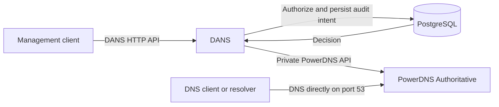

# DANS

DNS Authorization and Name Service is a PostgreSQL-backed policy gateway for PowerDNS Authoritative. It lets identities and groups share a zone while limiting writes by identities without the DANS operator role to exact or Route 53-style glob matches over whole RRsets, including PTR records, without creating subzones.

DANS exposes the pinned PowerDNS 5.1 API plus identity, group, token, delegation, binding, lifecycle, and audit resources. Use it when DNS changes need delegated authority and an audit trail while ordinary authoritative DNS stays independent of the management plane.

## Before you start

Use a checkout on macOS or Linux. Run the commands below from the directory containing `Makefile`, `compose.yaml`, and `scripts/`:

```sh
cd /path/to/checkout
make help
```

The supported evaluation path requires a running Docker daemon, Docker Compose v2, and Make. The service dependencies run in Docker; the Make targets and shell checks run from the checkout. The development wrapper uses a portable atomic `mkdir` lock on both macOS and Linux. Local stack state and credentials are kept under the ignored `.dans/` directory.

## Five-minute quickstart

The local stack is disposable and intended only for development and evaluation. It builds DANS from this checkout, initializes PostgreSQL and PowerDNS, and creates development-only credentials. Do not expose it publicly or reuse its credentials elsewhere.

Prerequisites are macOS or Linux, Docker with Compose v2, and Make. The quickstart does not require Go on the host.

```sh
make up
make smoke
```

`make up` initializes the installation, stores the local DANS operator token at `.dans/dev/operator-token`, and prints the console URL and sign-in token after startup succeeds. `make smoke` creates an isolated fixture, performs an allowed delegated RRset write, confirms an out-of-scope write is denied, queries authoritative DNS, and verifies the audit outcome.

After `make up`, optional `make smoke-host` repeats that fixture check and verifies the published loopback HTTP and DNS paths from the host over both UDP and TCP. It requires host `curl` and `dig`; ordinary `make smoke` remains Docker-only.

Successful output from `make up` includes loopback HTTP/DNS addresses and a console sign-in token. `make smoke` ends with `smoke: ok ...`; keep the token private and do not paste startup output into issues or logs.

Run stack lifecycle through Make. Its targets wrap Compose and keep container, volume, image, and credential state bound to this checkout, even if the checkout moves.

DANS listens at `http://127.0.0.1:8080`; authoritative DNS listens on TCP and UDP at `127.0.0.1:1053`. To avoid port conflicts, export the two overrides before running stack commands:

```sh
export DANS_DEV_HTTP_PORT=18080
export DANS_DEV_DNS_PORT=15353
make up
make smoke
```

Use `make status` to inspect the stack, `make logs` to follow logs, and `make down` to stop containers while preserving data and credentials. To delete the entire local installation, including PostgreSQL and PowerDNS data and local credentials, explicitly confirm the reset:

```sh
make reset CONFIRM=1
```

## Workflow prerequisites

Use `make help` as the authoritative command reference. This table shows which tools belong on the host and which workflow uses Docker:

| Workflow | Host prerequisites | Start here | Where it runs |
| --- | --- | --- | --- |
| Evaluate the local service | macOS/Linux, Docker Compose v2, Make | `make up` then `make smoke` | DANS, PostgreSQL, PowerDNS, and the CLI run in Docker |
| Verify published host access | Evaluation prerequisites plus `curl` and `dig` | `make smoke-host` | HTTP/DNS probes run on the host; the fixture runs in Docker |
| Native Go work | Go toolchain selected by `go.mod` (`go1.26.5` currently) | `make test`, `make generate-check` | On the host |
| Frontend work | Node.js 24, npm, and the Playwright Chromium browser | `make frontend`, `make frontend-test` | On the host |
| Full integration | Docker, `curl`, `dig`, `jq`, `mktemp`, and standard shell tools | `make integration` | The harness and all services use Docker |

The full integration image builds its Go and frontend dependencies in Docker, so it does not require a native Go or Node installation. `make dev-contract` checks the local Compose, Make, script, and documentation contract; CI also runs a Linux lifecycle pass covering persistence, credential recovery, refusal of an occupied checkout, and cleanup after an injected failure.

## Troubleshooting

Start with observation before changing state:

```sh
docker info
docker compose version
make status
make logs
```

If Docker or Compose is unavailable, start the Docker daemon and repeat the first two checks. If a published port is occupied, inspect `make status`, choose unused loopback ports, and rerun the stack commands with both overrides:

```sh
export DANS_DEV_HTTP_PORT=18080
export DANS_DEV_DNS_PORT=15353
make up
make smoke
```

If readiness fails, keep the containers running long enough to inspect `make status` and `make logs`. A dependency, migration, or PowerDNS failure is not repaired by deleting the local token; correct the underlying failure and retry.

If a command reports a stale development lock after an interruption, first verify that no stack command or Docker operation is still active. Only then remove the specific lock directory named by the diagnostic and retry; never remove a lock held by a live operation.

If `.dans/dev/compose-project` is missing, reset refuses to guess which legacy Compose project belongs to the checkout. Inspect the legacy project first, then provide the verified name explicitly: `DANS_DEV_LEGACY_PROJECT_NAME=dans-dev make reset CONFIRM=1`.

If the local token is missing or the API rejects it with HTTP 401, rerun `make up`. Startup can recover a token only for the existing enabled local development operator, validates it before replacing `.dans/dev/operator-token`, and keeps the file restricted. It does not create, enable, or promote identities, and it does not recover from non-401 transport, database, or dependency failures. An unexpected identity or disabled/non-operator account fails closed; use the [token recovery runbook](docs/operations/runbooks.md#token-rotation-and-offline-recovery) for production procedures.

`make down` stops the local containers but preserves database/DNS volumes and `.dans/dev`, so a later `make up` reuses the installation and credential. `make smoke` intentionally retains its synthetic fixtures for repeatable inspection. When a disposable checkout is no longer needed, `make reset CONFIRM=1` removes the local credentials, volumes, and project state; it is destructive and is not a first-line troubleshooting step. For deployed systems, use the [deployment examples](deploy/README.md) and [operations runbooks](docs/operations/runbooks.md), not the local Compose recovery behavior.

## Browser console

Open the console URL printed by `make up` and sign in with its operator token. Both `http://localhost:8080/console/` and `http://127.0.0.1:8080/console/` work locally; adjust the port if overridden. The local Compose stack explicitly enables `development-http` cookies so Safari can sign in over HTTP. These cookies remain HttpOnly and SameSite=Strict, with the same seven-day maximum and current token checks. The default `secure` mode uses a separate Secure cookie and HTTPS ingress for production.

The console provides zones, complete RRset editing, server-side paginated browsing, operator delegations, and audit history. Identity and group administration remain in the CLI. Large zones index on first access; the table shows progress and freshness. See the [console guide](docs/frontend.md) and [API/session contract](docs/api.md).

## How it works



Management requests pass through DANS, which evaluates PostgreSQL-backed policy and records audit state before making authorized changes through the private PowerDNS API. DNS queries go directly to PowerDNS, so authoritative serving does not depend on DANS availability.

## Contributing

Native development uses the Go version in `go.mod`. Building the embedded React/TypeScript console additionally uses Node.js 24 and npm. The common checks are:

```sh
make frontend
make frontend-test
make test
make generate-check
make integration
make dev-contract
```

Run `make help` for the authoritative list and description of supported commands. `make generate` uses the pinned Go 1.26.5 toolchain so the compressed API artifact matches CI and release builds. `make frontend` installs the pinned lockfile and rebuilds checked-in embedded assets; rebuild them after changing `web/`. For frontend iteration, `npm --prefix web run dev` serves the console and proxies `/api` to the local DANS service. Install the test browser once with `cd web && npx playwright install chromium`. Production requires only the DANS executable, not Node.js.

## Production boundary

The root Compose stack is not a production deployment. A platform operator should place private DANS instances behind trusted TLS ingress, connect them to externally managed PostgreSQL and PowerDNS services, and prevent clients from reaching the PowerDNS API or key directly. See the [deployment examples](deploy/README.md), [immutable configuration reference](docs/cli.md), and [operations runbooks](docs/operations/runbooks.md).

In this documentation, a **DANS operator** is a privileged identity inside DANS; a **platform operator** deploys and runs the service.

## Further documentation

- [Public API and generated Go client](docs/api.md)
- [CLI and immutable configuration](docs/cli.md)
- [Policy examples, route classes, and v1 limitations](docs/policy.md)
- [Operations runbooks](docs/operations/runbooks.md)
- [Deployment examples](deploy/README.md)
- [Release artifacts](docs/release.md)
- [Measured performance and resource baseline](openspec/changes/archive/2026-08-17-build-dans-v1/evidence/performance/README.md)
- [Combined OpenAPI source](api/openapi/README.md)
- [Architecture decisions](docs/adr/0001-expose-a-classified-powerdns-api.md)
