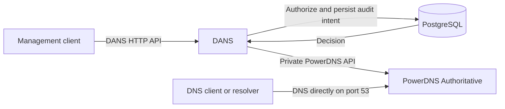

# DANS

DNS Authorization and Name Service is a PostgreSQL-backed policy gateway for PowerDNS Authoritative. It lets identities and groups share a zone while limiting writes by identities without the DANS operator role to exact or Route 53-style glob matches over whole RRsets, including PTR records, without creating subzones.

DANS exposes the pinned PowerDNS 5.1 API plus identity, group, token, delegation, binding, lifecycle, and audit resources. Use it when DNS changes need delegated authority and an audit trail while ordinary authoritative DNS stays independent of the management plane.

## Five-minute quickstart

The local stack is disposable and intended only for development and evaluation. It builds DANS from this checkout, initializes PostgreSQL and PowerDNS, and creates development-only credentials. Do not expose it publicly or reuse its credentials elsewhere.

Prerequisites are macOS or Linux, Docker with Compose v2, and Make. The quickstart does not require Go on the host.

```sh
make up
make smoke
```

`make up` initializes the installation and stores the local DANS operator token at `.dans/dev/operator-token`. `make smoke` creates an isolated fixture, performs an allowed delegated RRset write, confirms an out-of-scope write is denied, queries authoritative DNS, and verifies the audit outcome.

Run stack lifecycle through Make. Its targets wrap Compose and keep container, volume, image, and credential state bound to this checkout, even if the checkout moves.

DANS listens at `http://127.0.0.1:8080`; authoritative DNS listens on TCP and UDP at `127.0.0.1:1053`. To avoid port conflicts, export the two overrides before running stack commands:

```sh
export DANS_DEV_HTTP_PORT=18080
export DANS_DEV_DNS_PORT=15353
make up
make smoke
```

Use `make status` to inspect the stack, `make logs` to follow logs, and `make down` to stop containers while preserving data and credentials. To delete the entire local installation, including PostgreSQL and PowerDNS data and local credentials, explicitly confirm the reset:

```sh
make reset CONFIRM=1
```

## How it works



Management requests pass through DANS, which evaluates PostgreSQL-backed policy and records audit state before making authorized changes through the private PowerDNS API. DNS queries go directly to PowerDNS, so authoritative serving does not depend on DANS availability.

## Contributing

A Go toolchain is needed only for native development. The common checks are:

```sh
make test
make generate-check
make integration
make dev-contract
```

Run `make help` for the authoritative list and description of supported commands.

## Production boundary

The root Compose stack is not a production deployment. A platform operator should place private DANS instances behind trusted TLS ingress, connect them to externally managed PostgreSQL and PowerDNS services, and prevent clients from reaching the PowerDNS API or key directly. See the [deployment examples](deploy/README.md), [immutable configuration reference](docs/cli.md), and [operations runbooks](docs/operations/runbooks.md).

In this documentation, a **DANS operator** is a privileged identity inside DANS; a **platform operator** deploys and runs the service.

## Further documentation

- [Public API and generated Go client](docs/api.md)
- [CLI and immutable configuration](docs/cli.md)
- [Policy examples, route classes, and v1 limitations](docs/policy.md)
- [Operations runbooks](docs/operations/runbooks.md)
- [Deployment examples](deploy/README.md)
- [Release artifacts](docs/release.md)
- [Measured performance and resource baseline](openspec/changes/archive/2026-08-17-build-dans-v1/evidence/performance/README.md)
- [Combined OpenAPI source](api/openapi/README.md)
- [Architecture decisions](docs/adr/0001-expose-a-classified-powerdns-api.md)
